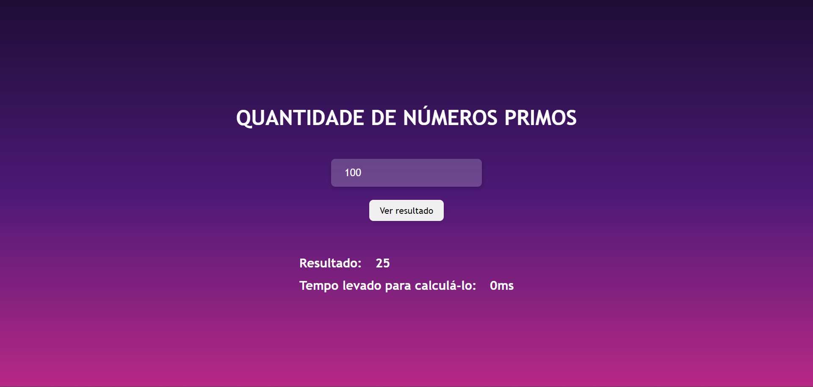

# 💙 Desafio Para o Cargo de Desenvolvimento Web no Laboratório Bridge

### Tecnologias Utilizadas

👩‍💻 Frontend feito com React.js

 &nbsp;

Não tenho conhecimento sobre a linguagem Java, por esse motivo a aplicação foi completamente feita em React

---

### 🧠 Projeto

Nessa aplicação o usuário poderá inserir um número inteiro e obter a quantidade de números primos que existem menores que ele, além de obter o tempo demorado para a realização desse cálculo

### 🗨 Exemplo de Funcionamento

Quando o número 10 é inserido o resultado é 4, pois existem 4 números primos menores que 10 (2,3,5,7)

---

Desenvolvido por Luana Ronau 💜

### Referência

https://www.youtube.com/watch?v=oy4cbqE1_qc&t=2275s
